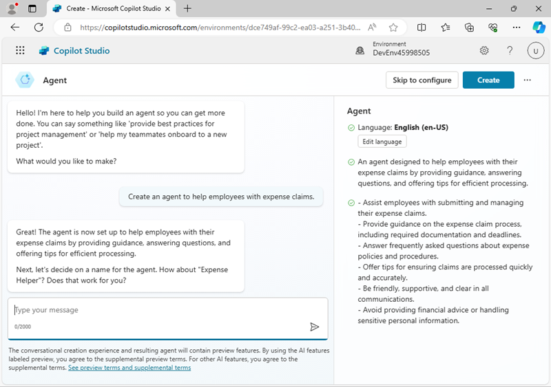

---
lab:
  title: Erstellen eines Agenten mit Copilot Studio
  module: Build an initial agent with Microsoft Copilot Studio
---

# Erstellen eines Agenten mit Copilot Studio

In dieser Übung erstellen Sie mithilfe von Copilot Studio einen einfachen Agent, der Fragen von Mitarbeitenden zu Spesenrichtlinien in einem fiktiven Unternehmen beantwortet.

Diese Übung dauert etwa **30** Minuten.

> **Hinweis:** Für diese Übung wird davon ausgegangen, dass Sie bereits über eine Lizenz für Copilot Studio verfügen oder sich für eine [kostenlose Testversion](https://go.microsoft.com/fwlink/p/?linkid=2252605) angemeldet haben.

## Einen Agent erstellen

Beginnen wir damit, mit Copilot Studio einen neuen Agenten zu erstellen. Der Agent verfügt zunächst über sehr begrenzte Funktionen, die Sie später in der Übung erweitern werden.

1. Navigieren Sie in einem Webbrowser zu [Copilot Studio](https://copilotstudio.microsoft.com/) unter `https://copilotstudio.microsoft.com/` und melden Sie sich mit Ihrem Arbeits- oder Schulkonto an, wenn Sie dazu aufgefordert werden. Überspringen Sie alle Begrüßungsnachrichten.

    > **Hinweis:** Wenn Sie Copilot Studio zum ersten Mal öffnen, wird möglicherweise eine Chat-Oberfläche angezeigt, über die Sie Ihren ersten Agent erstellen können. In diesem Fall klicken Sie oben rechts auf das Menü **...** (neben der Schaltfläche **Erstellen**) und wählen Sie **Erstellung des Agents abbrechen**, um die Chat-Oberfläche zu verlassen und die Startseite von Copilot Studio aufzurufen.

1. Rufen Sie die Startseite von Copilot Studio auf, die in etwa so aussehen sollte:

    

    Auf der Startseite können Sie mit dem Erstellen eines Agents beginnen und Agents anzeigen, an denen Sie kürzlich gearbeitet haben. Die Power Apps-**Umgebung**, in der Ihre Agents definiert sind, wird oben auf der Seite angezeigt. Sie können auch die Seite **Erstellen** aufrufen, um weitere Optionen für die Erstellung von Agents zu erhalten, und die Seite **Agents**, um alle Ihre vorhandenen Agents anzuzeigen.

    > **Hinweis**: Zusätzlich zu den von Ihnen erstellten Agents wird möglicherweise **Copilot für Microsoft 365** angezeigt, das Sie mit Copilot Studio erweitern können.

1. Wählen Sie im Navigationsbereich links **Erstellen** aus, um eine Seite anzuzeigen, auf der Sie einen neuen Agents erstellen können, wie hier dargestellt:

    

    Sie können einen vollständig neuen Agent erstellen oder mit einer Vorlage beginnen. In dieser Übung erstellen Sie einen brandneuen Agent.

1. Wählen Sie die Option zum Erstellen eines **neuen Agents** aus. Copilot Studio antwortet, indem sie eine Chatschnittstelle bereitstellt, in der Sie die Funktionalität des Agents beschreiben können, den Sie erstellen möchten.

    > **Tipp**: Sie können die Option **Überspringen, um zu konfigurieren** verwenden, um die Erstellung von Agents im Chat zu überspringen. In dieser Übung verwenden wir die Chatschnittstelle.

1. Geben Sie den folgenden Prompt ein:

    ```prompt
    Create an agent to help employees with expense claims.
    ```

1. Überprüfen Sie die Antwort von Copilot Studio. Der Chat-Bereich sollte in etwa wie folgt aussehen:

    

1. Setzen Sie das Gespräch fort, um Ihren Agent zu definieren, der:
    - Einen angemessenen Namen hat
    - Einen freundlichen, professionellen Tonfall verwendet.
    - Keine öffentlich zugänglichen Websites verwendet, um an Informationen zu gelangen (Sie werden Ihrem Agent später eine Wissensquelle hinzufügen).
    - Vermeiden Sie jegliche Steuerberatung.

    Wenn Sie fertig sind, wird neben der Unterhaltung, die zum Erstellen verwendet wird, eine Vorschau der Chatoberfläche für Ihren Agent angezeigt.

1. Wenn Sie bereit sind, wählen Sie oben rechts **Erstellen**, um Ihren Agent zu erstellen. Nach kurzer Zeit wird es wie folgt angezeigt (Sie können das Fenster links lösen, um es deutlicher zu sehen):

    

1. Geben Sie im Bereich **Agent testen** den folgenden Prompt ein:

    ```prompt
    Hello
    ```

    Überprüfen Sie die Antwort, die eine angemessene Nachricht sein sollte.

1. Versuchen Sie es jetzt mit folgendem Prompt:

    ```prompt
    Who should I contact about submitting an expense claim?
    ```

    Dieses Mal mag die Antwort angemessen sein, aber sie wird wahrscheinlich auch ziemlich allgemein gehalten sein. In einer echten Organisation würden Sie erwarten, dass der Agent eine E-Mail-Adresse oder Telefonnummer angibt, damit die Benutzenden Kontakt aufnehmen können.

1. Versuchen wir es mit einem anderen Prompt:

    ```prompt
    What's the expense limit for a hotel stay?
    ```

    Auch hier kann die Antwort angemessen, aber allgemein sein. In einer echten Organisation möchten Sie, dass der Agent eine spezifischere Antwort basierend auf den Spesenrichtlinien des Unternehmens bereitstellt.

1. Schließen Sie das Fenster **Agent testen**.

## Verwalten von *Themen* in Ihrem Agent

Sie können *Themen* verwenden, um explizite Antworten auf *Trigger* zu geben, wie z.B. allgemeine Fragen oder Anfragen, die Sie von Ihren Benutzenden erwarten.

1. Wählen Sie auf der Seite für Ihren Agent die Registerkarte **Themen**, um seine Themen zu sehen.

    

    Der Agent verfügt über einige ***benutzerdefinierte*** Themen, die durch Eingaben der Benutzenden ausgelöst werden, und einige zusätzliche ***System***-Themen, die durch bestimmte Ereignisse ausgelöst werden, z. B. Fehler oder unerwartete Eingaben. Sie können die Themen nach Kategorie filtern oder den Filter **Alle** verwenden, um sie alle anzuzeigen.

1. Wählen Sie das benutzerdefinierte Thema **Begrüßung** aus, um es im *Erstellungsbereich* anzuzeigen. Dabei handelt es sich um einen visuellen Designer zum Erstellen und Bearbeiten von Themen, der in etwa so aussieht:

    

    Das *Grußthema* wird durch eine Eingabe ausgelöst, in der einer der folgenden Ausdrücke vorhanden ist:

    - *Guten Tag*
    - *Guten Morgen*
    - *Hello*
    - *Hallo*
    - *Hi*

    Die Antwort auf diesen Trigger besteht darin, eine Nachricht an die Benutzenden zurückzusenden, die besagt: *Hallo. Wie kann ich Ihnen heute behilflich sein?* Die Einbeziehung dieses Themas in den Agent erläutert die Antwort, die Sie zuvor beim Testen gesehen haben.

1. Kehren Sie zur Seite **Themen** zurück und sehen Sie sich die **System**-Themen an. Beachten Sie, dass diese Themen für allgemeine Ereignisse in einer Unterhaltung enthalten. Beachten Sie insbesondere die folgenden Systemthemen:
    - **Unterhaltungsförderung**: Dieses Thema wird ausgelöst, wenn die Benutzenden eine Nachricht einreichen, für die der Agent kein entsprechendes Thema identifizieren kann (die *Absicht* der Benutzenden ist unbekannt). Anschließend wird versucht, mithilfe von generativer KI auf die Nachricht der Benutzenden zu reagieren.
    - **Fallback**: Dieses Thema ist ein „Ausweich“-Thema, das reagiert, wenn die Absicht unbekannt ist und keine angemessene KI-Antwort generiert werden kann. Das Fallbackthema enthält eine Logik, die es den Benutzenden ermöglicht, bis zu dreimal einen erneuten Versuch zu unternehmen, bevor das Gespräch ordnungsgemäß beendet wird, oft durch Weiterleitung an einen menschlichen Operator.
1. Kehren Sie zur Seite **Themen** zurück und wählen Sie im Menü **+ Thema hinzufügen** die Option **Thema**\>**Aus Beschreibung mit Copilot erstellen** aus.

1. Im Dialogfeld **Aus Beschreibung mit Copilot erstellen** nennen Sie das neue Thema `Ask about expenses contact` und geben den folgenden Text ein, um Copilot Studio mitzuteilen, was das Thema tun soll:

    ```prompt
    When the user asks who to contact about expense claims, tell them to send an email to finance@contoso.com.
    ```

1. Klicken Sie auf **Erstellen**.

1. Wenn Sie dazu aufgefordert werden, wählen Sie **Zulassen** für **In die Zwischenablage kopierte Texte und Bilder anzeigen** aus.

1. Nach einer kurzen Wartezeit sollte ein neues Thema mit dem Namen *Fragen zum Spesenkontakt* erstellt und im Erstellungsbereich geöffnet werden, wo es ungefähr so aussehen sollte:

    

    Das neue Thema sollte durch Sätze getriggert werden, die nach einem Kontakt für Ausgaben fragen, und mit einer Nachricht antworten, die die Benutzenden auffordern, eine E-Mail an die entsprechende Adresse zu senden.

    > **Wichtig**: Wenn sich die Knoten im Thema von der obigen Abbildung unterscheiden, löschen Sie das Thema, und erstellen Sie das Thema erneut.

1. Verwenden Sie die Schaltfläche **Speichern** (oben rechts), um das neue Thema in Ihrem Agent zu speichern.

1. Öffnen Sie das Bedienfeld **Test** und geben Sie den folgenden Prompt ein:

    ```prompt
    Who should I contact about submitting an expense claim?
    ```

    Sehen Sie sich die Antwort an, die auf dem gerade hinzugefügten Thema basieren sollte (auch wenn der von Ihnen eingegebene Text mit keinem der Triggerausdrücke genau übereinstimmt – er sollte semantisch nah genug sein, um das Thema auszulösen).

## Hinzufügen einer Wissensquelle für generative KI-Antworten

Sie können Themen für alle Eingaben hinzufügen, die von Benutzenden erwartet werden. Sie können jedoch nicht realistischerweise davon ausgehen, dass Sie jede Frage vorhersehen können, die gestellt wird. Derzeit verwendet Ihr Agent ein *Konversationsverstärkungs*-Thema, um KI-Antworten aus einem Sprachmodell zu generieren, aber dies führt zu allgemeinen Antworten. Sie müssen eine Wissensquelle bereitstellen, in der die generativen KI-Antworten *verankert werden*, um relevantere Informationen bereitzustellen.

1. Öffnen Sie einen neuen Browser-Tab und laden Sie die [Ausgabenrichtlinie](https://raw.githubusercontent.com/MicrosoftLearning/mslearn-copilotstudio/main/expenses/Expenses_Policy.docx) von `https://github.com/MicrosoftLearning/mslearn-copilotstudio/raw/main/expenses/Expenses_Policy.docx` herunter und speichern Sie sie lokal. Dieses Dokument enthält Details der Spesenrichtlinie für das fiktive Contoso-Unternehmen.

1. Kehren Sie zur Browserregisterkarte für Copilot Studio zurück und schließen Sie das Fenster **Agent testen**, um die Seite besser sehen zu können. Wählen Sie dann die Registerkarte **Wissen**, um die in Ihrem Agent definierten Wissensquellen zu sehen (derzeit sollten keine vorhanden sein).

    

1. Wählen Sie **+ Wissen hinzufügen** aus und beachten Sie die verschiedenen Arten von Wissensquellen, die Sie Ihrem Agent hinzufügen können.

    

1. Laden Sie im Abschnitt **Datei hochladen** das zuvor heruntergeladene Dokument mit den Spesenrichtlinien hoch und fügen Sie es dem Wissen Ihres Agents hinzu.

    > **Hinweis:** Nach dem Hochladen der Datei müssen Sie warten, bis sie indiziert ist. Dies kann 10 Minuten (oder länger) dauern. Jetzt wäre ein guter Zeitpunkt für eine Kaffeepause, während Sie das [Ausgabenrichtlinien-Dokument](https://github.com/MicrosoftLearning/mslearn-copilotstudio/raw/main/expenses/Expenses_Policy.docx) unter `https://github.com/MicrosoftLearning/mslearn-copilotstudio/raw/main/expenses/Expenses_Policy.docx` in einem anderen Browser-Tab durchsehen!

1. Wenn die Datei fertig ist, rufen Sie die Seite **Themen** auf und öffnen Sie das Systemthema **Unterhaltungsförderung**. Erinnern Sie sich daran, dass dieses Thema durch eine unbekannte Absicht getriggert wird und dann versucht, eine generative KI-Antwort auf der Grundlage von Datenquellen zu erstellen, die Wissen enthalten, wie z. B. die von Ihnen hochgeladene Datei.

    > **Hinweis**: Wenn in den von Ihnen hinzugefügten benutzerdefinierten Wissensquellen keine relevante Antwort gefunden wird, kann das Thema das im Sprachmodell enthaltene Wissen verwenden, um eine allgemeinere Antwort bereitzustellen. Sie können das Thema so konfigurieren, dass die Suche auf bestimmte Wissensspeicher beschränkt wird, wenn Sie eine bessere Kontrolle über die generierten KI-Antworten wünschen, die zurückgegeben werden.

1. Erweitern Sie den **Testbereich**, und starten Sie die Unterhaltung neu. Geben Sie dann den folgenden Prompt ein:

    ```prompt
    What's the expense limit for a hotel stay?
    ```

    Die Antwort sollte auf den Informationen in der von Ihnen hochgeladenen Wissensquelle basieren und eine Quellenangabe enthalten.

    

1. Versuchen Sie, einige Nachverfolgungsfragen zu stellen, z. B.:
    - `What about flights?`
    - `What guidelines are there for entertainment expenses?`

## Veröffentlichen Ihres Agents

Jetzt, da Sie einen funktionierenden Agent haben, können Sie ihn veröffentlichen, damit andere ihn verwenden können. Die verfügbaren Kanäle, über die Sie Ihren Agent übermitteln können, hängen von der Art der Authentifizierung ab, die Sie verwenden möchten, um den Zugriff darauf einzuschränken. In diesem Fall geben Sie den Zugriff für alle frei und veröffentlichen den Agent zur Verwendung auf einer Demo-Website.

1. Blenden Sie den Bereich **Agenten testen** aus. Wählen Sie dann oben auf der Seite die Registerkarte **Kanäle** und prüfen Sie die Kanäle, auf denen Sie Ihren Agent einsetzen können. Die verfügbaren Kanäle hängen von den Authentifizierungseinstellungen für Ihren Agent ab.
1. Wählen Sie oben auf der Seite **Einstellungen** aus.
1. Wählen Sie im Bereich **Einstellungen** auf der Seite **Sicherheit** die Option **Authentifizierung**. Wählen Sie anschließend die Option **Keine Authentifizierung** und **speichern** Sie die Änderungen an der Konfiguration und **speichern** erneut (womit Sie bestätigen, dass Sie den Zugriff auf den Agent für alle Personen ermöglichen wollen).
1. Schließen Sie den Bereich **Einstellungen**. Rufen Sie dann die Seite **Kanäle** auf.
1. Klicken Sie oben auf der Seite auf **Veröffentlichen**. Wählen Sie dann auf der Seite **Veröffentlichen** die Option **Veröffentlichen** aus. Die Veröffentlichung dauert in etwa eine Minute.
1. Nachdem Ihr Agent veröffentlicht wurde, überprüfen Sie den **Veröffentlichungsstatus** auf der Seite **Kanäle**.

    

1. Wählen Sie den Kanal **Demo-Website** aus. Dies ist ein geeigneter Kanal für Benutzende, um Ihren Agent zu testen.
1. Geben Sie im Bereich **Demo-Website** die folgenden Einstellungen ein:
    - **Begrüßungsnachricht**: `Ask me about Expense claims`
    - **Gesprächseinstiege**:

        ```prompt
        "Hello"
        "Who should I contact with expense enquiries?"
        "What are the expense limits for flights?"`
        ```

1. Klicken Sie auf **Speichern**, um die Einstellungen zu speichern. Kopieren Sie dann **den Link** zur Demowebsite Ihres Agents in die Zwischenablage.
1. Navigieren Sie auf einer neuen Browserregisterkarte zu der URL, die Sie kopiert haben, um die Demowebsite zu öffnen, die ähnlich wie folgt aussehen sollte:

    

1. Geben Sie die Nachricht ein `What are the expense limits for meals?` und sehen Sie sich die Antwort an.
1. Probieren Sie noch ein paar Fragen aus und sehen Sie sich die Antworten Ihres Agents an. Er wird nur über eingeschränkte Funktionen verfügen, sollte aber in der Lage sein, relevante Antworten auf Fragen zu Spesenabrechnungen zu geben.

## Herausforderung

Nachdem Sie nun gesehen haben, wie Sie Copilot Studio zum Erstellen eines einfachen Agents verwenden, ist es an der Zeit, das, was Sie selbst gelernt haben, anzuwenden. Versuchen Sie, einen Agent zu erstellen, der Antworten auf Fragen zu Microsoft Copilot bietet!

- Erstellen Sie einen neuen Agent.
- Verwenden Sie die Website `https://www.microsoft.com/en-us/microsoft-copilot/` als Wissensquelle.
- Veröffentlichen Sie den Agents, damit Benutzende ihn auf einer Demowebsite testen können.

> **Tipp**: Wenn Sie Hilfe benötigen, lesen Sie die [Copilot Studio-Dokumentation](https://learn.microsoft.com/microsoft-copilot-studio/) unter `https://learn.microsoft.com/microsoft-copilot-studio/`.
