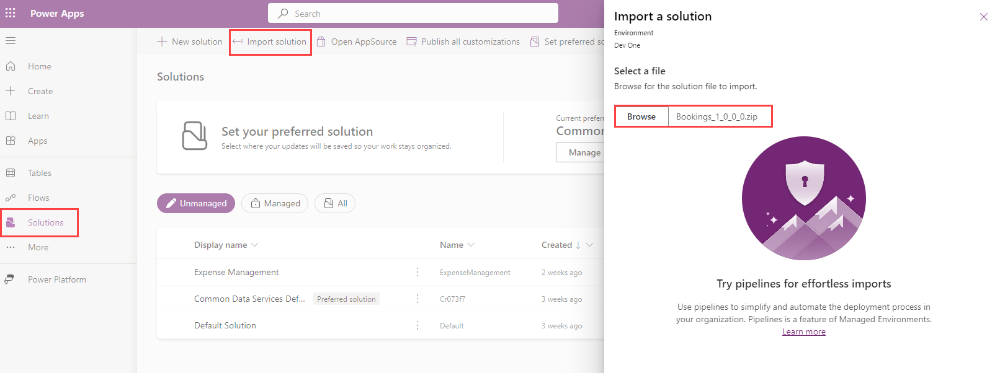

---
lab:
  title: Importieren einer Dataverse-Lösung
  module: Course Introduction
---

# Importieren einer Dataverse-Lösung

In dieser Übung importieren Sie eine Dataverse-Lösung, die für die folgenden Labs verwendet werden soll.

> **Hinweis**: Diese Übung setzt voraus, dass Sie bereits eine Copilot Studio-Lizenz besitzen oder sich für eine [kostenlose Testversion](https://go.microsoft.com/fwlink/p/?linkid=2252605) angemeldet haben und über eine Power Apps-Umgebung verfügen, in der Sie arbeiten können.

## Übung 1: Importieren einer Lösung

In dieser Übung importieren Sie eine Dataverse-Lösung in Ihre Umgebung, die die Tabellen enthält, die für die Labs erforderlich sind.

### Aufgabe 1.1: Anmelden bei Power Apps

1. Navigieren Sie in einer neuen Browserregisterkarte zu `https://make.powerapps.com`.

1. Wenn Sie zur Eingabe von Anmeldeinformationen aufgefordert werden, melden Sie sich bei Aufforderung mit Ihrer E-Mail-Adresse und Ihrem Kennwort an.

1. Wenn Sie zur Eingabe von Kontaktinformationen aufgefordert werden, geben Sie das Land/die Region an und wählen Sie **Erste Schritte**.

1. Überprüfen Sie oben rechts auf dem Bildschirm, ob die **Umgebung** auf Ihre Umgebung festgelegt ist. Hier werden Sie während der gesamten Laufzeit der Labs arbeiten. Falls nicht, wählen Sie die entsprechende Umgebung aus.

### Aufgabe 1.2: Herunterladen der Lösung

1. Wechseln Sie zu [**Bookings_1_0_0_0.zip**](../../Allfiles/Bookings_1_0_0_0.zip) in GitHub. Die Datei befindet sich unter `https://github.com/MicrosoftLearning/mslearn-copilotstudio/blob/main/Allfiles/Bookings_1_0_0_0.zip`

1. Wählen Sie die **Auslassungspunkte (...)** in der Nähe der oberen rechten Ecke und wählen Sie **Herunterladen**.

### Aufgabe 1.3: Importieren einer Lösung

1. Wechseln Sie zu `https://make.powerapps.com`.

1. Stellen Sie sicher, dass Sie sich in der richtigen Umgebung befinden.

1. Wählen Sie im linken Navigationsbereich **Lösungen**.

1. Wählen Sie in der oberen Leiste **Lösung importieren**.

1. Wählen Sie **Durchsuchen** und suchen Sie die Datei **Bookings_1_0_0_0.zip** und wählen Sie **Öffnen**.

    

1. Wählen Sie **Weiter** aus.

1. Klicken Sie auf **Importieren**.

    Die Lösung wird im Hintergrund importiert. Dies kann einige Minuten dauern.

    

    > **Warnung:** Warten Sie, bis die Lösung den Import abgeschlossen hat, bevor Sie mit dem nächsten Schritt fortfahren.

1. Wenn die Lösung erfolgreich importiert wurde, öffnen Sie die **Buchungs**-Lösung.

1. Wählen Sie in der linken Navigation die Registerkarte **Übersicht**.

    

1. Wählen Sie **Alle Anpassungen veröffentlichen** aus.

### Aufgabe 1.4: Testdaten

1. Wählen Sie in der linken Navigation der Buchungslösung die Registerkarte **Objekte**.

1. Wählen Sie das Auslassungszeichen (**...**). Wählen Sie **Spielen** auf der modellgesteuerten App **Immobilienverwaltung**.

    

1. Wählen Sie **+ Neu** aus.

1. Geben Sie die folgenden Daten ein:

    - **Eigenschaftenname:**`1100 High Villas`
    - **Preisvorstellung:**`250,000`
    - **Straße:**`Main Avenue`
    - **Stadt:**`Redmond`
    - **Schlafzimmer:**`3`
    - **Badezimmer:**`2`

    

1. Wählen Sie **Speichern und schließen** aus.

1. Wählen Sie **+ Neu** aus.

1. Geben Sie die folgenden Daten ein:

    - **Eigenschaftenname:**`555 Oak Lane`
    - **Preisvorstellung:**`300,000`
    - **Straße:**`Oak Lane`
    - **Stadt:**`Denver`
    - **Schlafzimmer:**`4`
    - **Badezimmer:**`3`

    

1. Wählen Sie **Speichern und schließen** aus.
