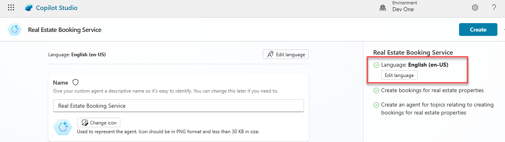
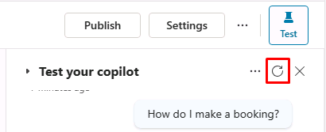
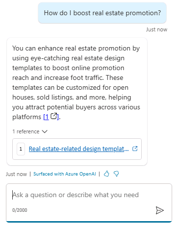

---
lab:
  title: Erstellen eines ersten Agents
  module: Build an initial agent with Microsoft Copilot Studio
---

# Erstellen eines ersten Agents

## Szenario

Dieses Lab deckt Folgendes ab:

- Erstellen und Benennen eines Agents
- Hinzufügen einer Beschreibung der Aufgaben des Agents
- Konfigurieren von generativen KI-Antworten

## Lernziele

- Wie man einen Agent mithilfe natürlicher Sprache erstellt
- Konfigurieren von generative KI-Antworten für einen Agent

## Weiterführende Schritte des Lab

- Erstellen eines neuen Agents
- Teilen Sie Ihrem Agent mit, was sein Hauptzweck ist und wie er handeln soll.
- Hinzufügen von generativen KI-Anweisungen
  
## Voraussetzungen

- Erfordert abgeschlossenes **Lab: Importieren der Dataverse-Lösung**

## Übung 1: Erstellen eines Agents

In dieser Übung greifen Sie auf das Microsoft Copilot Studio-Portal und die Umgebung für Fachkräfte in der Entwicklung zu und erstellen einen neuen Agent.

### Aufgabe 1.1: Microsoft Copilot Studio-Portal

1. Navigieren Sie in einer neuen Registerkarte zum Microsoft Copilot Studio-Portal `https://copilotstudio.microsoft.com` und melden Sie sich mit Ihren Microsoft 365-Anmeldedaten an, wenn Sie erneut dazu aufgefordert werden.

1. Wenn Sie dazu aufgefordert werden, wählen Sie **Kostenlose Testversion beginnen**.

1. Stellen Sie sicher, dass Sie sich in der entsprechenden Umgebung befinden.

### Aufgabe 1.2: Erstellen eines Agents

1. Wählen Sie im linken Navigationsbereich **Erstellen** aus und wählen Sie oben rechts **+ Neuer Agent** und **Konfiguration überspringen** aus.

1. Geben Sie in das Textfeld **Name** **`Real Estate Booking Service`** ein.

1. Geben Sie in das Textfeld **Beschreibung** **`Create bookings for real estate properties`** ein.

1. Geben Sie in das Textfeld **Anweisungen** **`Create an agent for topics relating to creating bookings for real estate properties`** ein.

1. Oben sollte **Sprache** auf **Englisch (en-US)** festgelegt werden.

    

1. Wählen Sie die **drei Punkte** oben rechts auf der Seite und wählen Sie **Erweiterte Einstellungen bearbeiten**.

    

1. Wählen Sie **Buchungen** unter **Lösung** aus.

1. Geben Sie `labcopilot` als **Schema-Namen** ein.

    

1. Wählen Sie **Speichern**.

1. Wählen Sie oben rechts auf dem Bildschirm **Erstellen**.

1. Geben Sie im rechten Fenster **Agent testen** **`How do I make a booking?`** ein. Zeigen Sie die Antwort an.

Lassen Sie dieses Fenster geöffnet.

## Übung 2: Hinzufügen von generativen KI-Antworten

In dieser Übung greifen Sie auf das Microsoft Copilot Studio-Portal zu und fügen Wissen hinzu, mit dem der Agent Fragen beantworten wird, indem Sie generative KI verwenden.

### Aufgabe 2.1: Aktivieren von generativen KI-Antworten

1. Stellen Sie auf der Registerkarte **Übersicht** sicher, dass **KI sein eigenes allgemeines Wissen zu nutzen erlauben** im Abschnitt **Wissen** auf **Aktiviert** festgelegt ist.

    

### Aufgabe 2.2: Hinzufügen einer Wissensquelle

1. Wählen Sie die Registerkarte **Wissen**.

    

1. Wählen Sie **+ Wissen hinzufügen**.

1. Wählen Sie **Öffentliche Websites** aus.

1. Geben Sie in das Textfeld **Link zur öffentlichen Website** **`https://create.microsoft.com/en-us/`** ein.

    

1. Wählen Sie **Hinzufügen**.

1. Wählen Sie **Hinzufügen**.

1. Klicken Sie auf die Registerkarte **Übersicht**.
    
1. Wählen Sie die **drei Punkte** am oberen Rand des Bereichs **Agent testen**.

1. Aktivieren Sie **Nachverfolgen der Themenverläufe**.

    

1. Wählen Sie oben im Bereich **Agenten testen** das Symbol **Eine neue Konversation beginnen** (Aktualisierungssymbol) aus.
    

1. Geben Sie in das Textfeld **Fragen stellen oder das Gesuchte beschreiben** **`How do I boost real estate promotion?`** ein.

    
