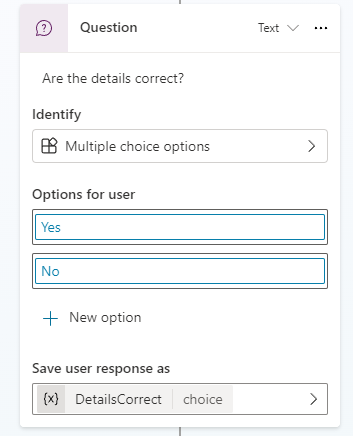

---
lab:
  title: Themen verwalten
  module: Manage topics in Microsoft Copilot Studio
---

# Themen verwalten

## Szenario

Dieses Lab deckt Folgendes ab:

- Verwaltung bestehender Themen
- Erstellung und Bearbeitung von Themen in natürlicher Sprache
- Manuelle Erstellung eines Themas mithilfe von Triggerausdrücken

## Lernziele

- Konfigurieren von Agent-Themen

## Weiterführende Schritte des Lab

- Löschen der Beispielthemen
- Deaktivieren von Themen
- Erstellen und bearbeiten von Themen mit natürlicher Sprache
- Erstellen eines neuen Themas und Hinzufügen von Triggerausdrücken
  
## Voraussetzungen

- Erfordert abgeschlossenes **Lab: Erstellen eines anfänglichen Agents**

## Ausführliche Schritte

## Übung 1: Entfernen von Themen

In dieser Übung werden Sie Themen aus einem Agent entfernen.

### Aufgabe 1.1: Deaktivieren von Themen

1. Navigieren Sie zum Microsoft Copilot Studio-Portal `https://copilotstudio.microsoft.com` und stellen Sie sicher, dass Sie sich in der entsprechenden Umgebung befinden.

1. Wählen Sie die Schaltfläche **Testen** oben rechts auf dem Bildschirm aus, um das Bedienfeld zu schließen, falls es geöffnet ist.

1. Wählen Sie **Agenten** im linken Navigationsbereich aus.

    

1. Wählen Sie den Agent, den Sie im vorherigen Lab erstellt haben.

1. Wählen Sie die Registerkarte **Themen**.

    

1. Schalten Sie für das Thema **Neustart** **Aktiviert** auf **Aus**.

    

## Übung 2: Erstellen von Themen mit natürlicher Sprache

In dieser Übung erstellen Sie Themen in einem Agent und fügen Triggerausdrücke hinzu.

### Aufgabe 2.1: Hinzufügen eines Themas mithilfe eines Copiloten

1. Wählen Sie **+ Thema hinzufügen** und wählen Sie **Aus Beschreibung erstellen mit Copilot**. Es wird ein neues Fenster angezeigt.

    

    

1. Geben Sie in das Textfeld **Thema benennen** **`Customer Details`** ein.

1. Geben Sie in das Textfeld **Thema erstellen zu …** **`Ask the customer for their name and email address.`** ein.

1. Klicken Sie auf **Erstellen**.

1. Wählen Sie **Speichern**.

### Aufgabe 2.2 : Aktualisieren von Knoten mit natürlicher Sprache

1. Wenn der Bereich **Mit Copilot bearbeiten** nicht auf der rechten Seite des Bereichs **Kundendetails** angezeigt wird, wählen Sie das Symbol **Copilot** im oberen Teil des Erstellungsbereichs.

    

1. Wählen Sie den zweiten Knoten **Frage** aus, **Wie lautet Ihre E-Mail-Adresse?**

    

1. Geben Sie im Bereich **Mit Copilot bearbeiten** im Feld **Was möchten Sie tun?** den folgenden Text ein:

    `Update the message in this Question node to say thank you to the Name variable from the previous node and then proceed to ask the email address question.`

1. Wählen Sie **Aktualisieren**.

    

    

    > **Hinweis**: Die Nachricht sollte aktualisiert werden, um die *Namenvariable* aus dem vorherigen Knoten einzuschließen, und sollte ähnlich wie der obige Screenshot aussehen.

1. Wählen Sie **Speichern**.

### Aufgabe 2.3: Hinzufügen von Knoten mit natürlicher Sprache

Sie können nicht nur bestehende Knoten aktualisieren, sondern mit Copilot auch neue Knoten hinzufügen.

1. Stellen Sie sicher, dass kein Knoten ausgewählt ist, indem Sie den leeren Bereich um die Knoten herum markieren.

1. Geben Sie im Bereich **Mit Copilot bearbeiten** im Feld **Was möchten Sie tun?** den folgenden Text ein:

    `Summarize the information collected in an adaptive card`

1. Wählen Sie **Aktualisieren**.

1. Zum Ende des Themas wird ein Nachrichtenknoten mit einer adaptiven Karte hinzugefügt.

    

1. Markieren Sie das Feld **Medien** auf der adaptiven Karte. Rechts auf dem Bildschirm sollten die Eigenschaften „Adaptive Karte“ angezeigt werden.

    

   Die Formel Ihrer adaptiven Karte sollte der oben angezeigten ähneln. Wenn dies nicht der Fall ist, können Sie die folgende Formel einfügen:

    ```json
    {
    type: "AdaptiveCard", 
        body: 
        [
            {
                type: "TextBlock",
                size: "Medium",
                weight: "Bolder",
                text: "Summary"    
            },
            {
                type: "FactSet",
                facts: 
                [
                    {
                        title: "Full Name",
                        value: Text(Topic.Name)
                    },
                    {
                        title: "Email Address",
                        value: Text(Topic.EmailAddress)
                    }
                ]
            },
            {
                type: "TextBlock",
                text: "Thank you for providing the information."
            }
        ]
    }
    ```

1. Wenn Sie die Eigenschaften der adaptiven Karte öffnen, wird das Bedienfeld **Mit Copilot bearbeiten** geschlossen. Daher müssen Sie das Symbol **Copilot** auswählen, um es wieder zu öffnen.

1. Stellen Sie sicher, dass kein Knoten ausgewählt ist, indem Sie den leeren Bereich um die Knoten herum markieren.

1. Geben Sie im Feld **Was möchten Sie tun?** den folgenden Text ein:

    `Add a new multiple choice question to prompt the user if the details are correct with two options Yes or No`

1. Wählen Sie **Aktualisieren**.

1. Am Ende des Themas wird ein neuer Frageknoten hinzugefügt, der Optionen für den Benutzer hinzufügt.

    

1. Wählen Sie **Speichern**.

### Aufgabe 2.4: Testen des Themas

1. Wählen Sie die Schaltfläche **Testen** in der oberen rechten Ecke des Bildschirms, um das Bedienfeld zu öffnen, falls es geschlossen ist.

1. Wählen Sie das Symbol **Neue Konversation beginnen** oben auf dem Bedienfeld für Tests.

1. Geben Sie in das Textfeld **Fragen stellen oder das Gesuchte beschreiben** **`Customer information`** ein.

1. Geben Sie Ihren Namen und Ihre E-Mail-Adresse ein.

1. Wählen Sie **Ja** aus.

## Übung 3: Manuelles Erstellen von Themen

Themen können manuell erstellt werden, indem Sie Triggerausdrücke hinzufügen.

### Aufgabe 3.1: Erstellen eines Themas ohne Vorlage

1. Wählen Sie die Registerkarte **Themen** in der oberen Leiste von **Immobilien-Buchungsdienst**.

1. Wählen Sie **+ Thema hinzufügen** und dann **Ohne Vorlage**.

1. Wählen Sie das Symbol **Details**, um das Dialogfeld „Details“ zum Thema zu öffnen.

    

1. Geben Sie in das Feld **Name** den folgenden Text ein:

    `Book a Real Estate Showing`

1. Geben Sie in das Feld **Anzeigename** den folgenden Text ein:

    `Book`

1. Geben Sie in das Feld **Beschreibung** den folgenden Text ein:

    `Select the property and requested date and create a booking request`

1. Wählen Sie **Speichern**.

### Aufgabe 3.2: Hinzufügen von Triggerausdrücken

1. Wählen Sie **Bearbeiten** unter **Ausdrücke** im Menü **Auslöser**.

    

1. Geben Sie `I want to book a real estate showing` unter **Ausdrücke hinzufügen** ein und wählen Sie das Symbol **+** aus.

1. Geben Sie `Schedule a real estate showing` unter **Ausdrücke hinzufügen** ein und wählen Sie das Symbol **+** aus.

1. Geben Sie `Arrange the viewing for a real estate property` unter **Ausdrücke hinzufügen** ein und wählen Sie das Symbol **+** aus.

1. Geben Sie `Set up an appointment to view a house` unter **Ausdrücke hinzufügen** ein und wählen Sie das Symbol **+** aus.

1. Geben Sie `Plan a property viewing` unter **Ausdrücke hinzufügen** ein und wählen Sie das Symbol **+** aus.

1. Wählen Sie **Speichern**.
