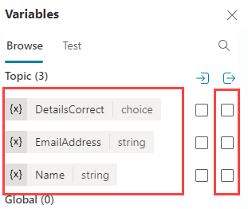
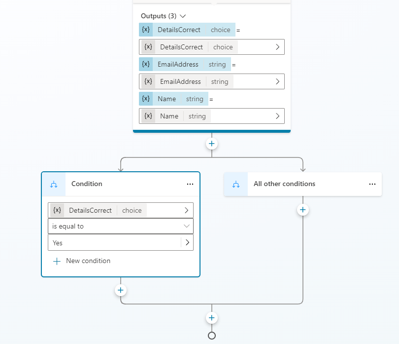
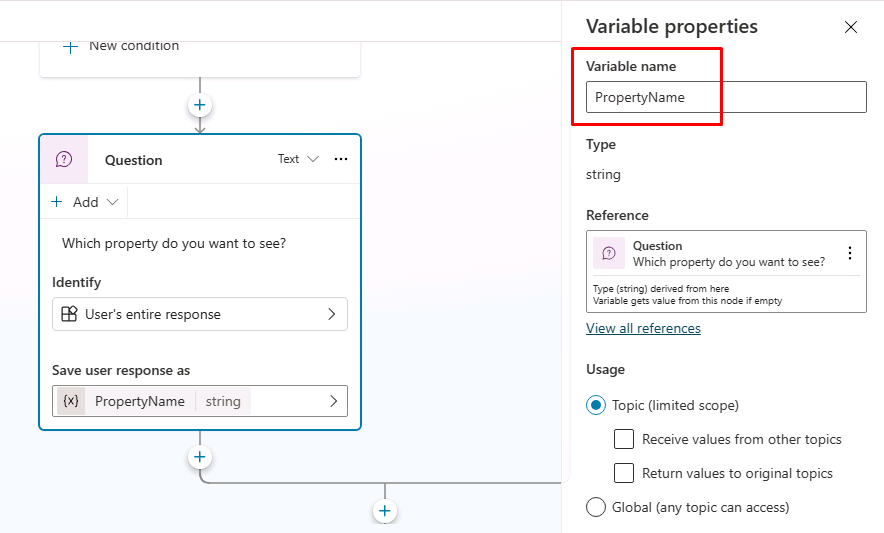
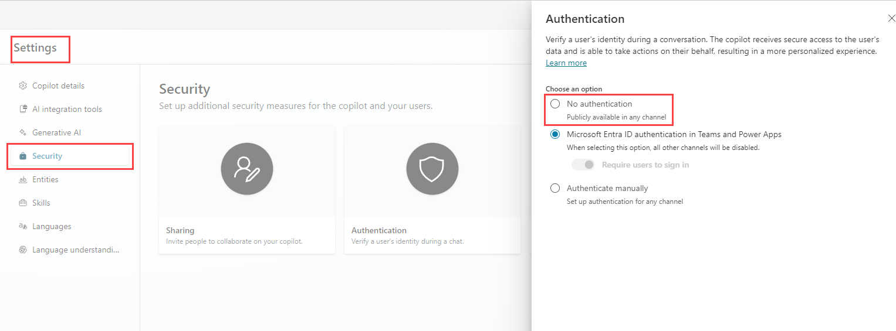

---
lab:
  title: Verwalten von Knoten
  module: Manage topics in Microsoft Copilot Studio
---

# Verwalten von Knoten

## Szenario

In dieser Übung führen Sie die folgenden Schritte aus:

- Erstellen des Unterhaltungsflows
- Verwalten von Variablen

Diese Übung dauert etwa **30** Minuten.

## Lernziele

- Hinzufügen von Knoten zu einem Thema, um den Unterhaltungsflow zu steuern

## Weiterführende Schritte des Lab

- Konfigurieren des Variablenbereichs
- Erstellen und Bearbeiten von Knoten
- Bereitstellen und Testen des Agent
  
## Voraussetzungen

- Erfordert abgeschlossenes **Lab: Verwalten von Themen**

## Ausführliche Schritte

## Übung 1: Variabler Bereich

Auf Variablen kann von anderen Themen zugegriffen werden.

### Aufgabe 1.1: Konfigurieren des Bereichs der Variablen

1. Navigieren Sie zum Copilot Studio-Portal `https://copilotstudio.microsoft.com`, und stellen Sie sicher, dass Sie sich in der entsprechenden Umgebung befinden.

1. Wählen Sie **Agenten** im linken Navigationsbereich aus.

1. Wählen Sie den Agent aus, den Sie im vorherigen Lab erstellt haben.

1. Wählen Sie die Registerkarte **Themen**.

1. Wählen Sie das Thema **Kundendetails**.

1. Wählen Sie **Variablen** in der oberen Leiste, um den Variablenbereich zu öffnen.

1. Aktivieren Sie die Kontrollkästchen rechts für die drei Themenvariablen.

    

1. Wählen Sie **Speichern**.

## Übung 2: Manuelles Erstellen von Themen

Der Unterhaltungsflow in einem Thema kann manuell erstellt werden, indem Knoten hinzugefügt werden.

### Aufgabe 2.1: Hinzufügen eines Nachrichtenknotens

1. Wählen Sie die Registerkarte **Themen**.

1. Wählen Sie das Thema **Immobilienbesichtigung buchen**.

1. Wählen Sie das Symbol **+** unter dem Trigger-Knoten und wählen Sie **Nachricht senden**.

    

1. Geben Sie in das Feld **Nachricht eingeben** den folgenden Text ein:

    `Hi, I can help you with booking a real estate property showing.`

1. Wählen Sie **Speichern**.

### Aufgabe 2.2: Hinzufügen eines Themenverwaltungsknotens

1. Wählen Sie das Symbol **+** unter dem Knoten **Nachricht** aus, wählen Sie dann **Themenverwaltung** > **Zu einem anderen Thema wechseln** > **Kundendetails** aus.

    

1. Wählen Sie **Speichern**.

### Aufgabe 2.3: Hinzufügen eines Bedingungsknotens

1. Wählen Sie das Symbol **+** unter dem Knoten **Umleitung** und wählen Sie **Bedingung hinzufügen**.

1. Wählen Sie im Knoten **Bedingung** die Variable **DetailsCorrect**.

1. Wählen Sie **entspricht**.

1. Wählen Sie **Ja** aus.

    

1. Wählen Sie **Speichern**.

### Aufgabe 2.4: Hinzufügen von Frageknoten

1. Wählen Sie das Symbol **+** unter dem linken Knoten **Bedingung** und wählen Sie **Frage stellen**.

1. Geben Sie in das Feld **Nachricht eingeben** den folgenden Text ein:

    `Which property do you want to see?`

1. Wählen Sie **Gesamte Benutzerantwort** für **Identifizieren**.

1. Wählen Sie die Variable in **Benutzerantwort speichern unter** und geben Sie **`PropertyName`** für **Variablenname** ein.

    

1. Wählen Sie **Speichern**.

1. Wählen Sie das Symbol **+** unter dem neuen Knoten **Frage** und wählen Sie **Frage stellen**.

1. Geben Sie in das Feld **Nachricht eingeben** den folgenden Text ein:

    `What date and time do you want to see the property?`

1. Wählen Sie **Datum und Uhrzeit** für **Identifizieren**.

1. Wählen Sie die Variable in **Benutzerantwort speichern unter** und geben Sie **`DateTime`** für **Variablenname** ein.

1. Wählen Sie **Speichern**.

### Aufgabe 2.5 – Testen des Agents

1. Falls noch nicht geöffnet, wählen Sie die Schaltfläche **Test** in der oberen rechten Ecke des Bildschirms, um das Bedienfeld für Tests zu öffnen.

1. Wählen Sie die **drei Punkte** am oberen Rand des Bedienfelds oben rechts auf dem Bildschirm.

1. Wenn sie nicht aktiviert ist, aktivieren Sie **Nachverfolgen der Themenverläufe**.

    

1. Wählen Sie das Symbol **Neue Konversation beginnen** (Aktualisieren) oben auf dem Testpanel aus.

1. Wenn die Meldung **Gesprächsbeginn** erscheint, wird Ihr Agent ein Gespräch beginnen. Geben Sie als Antwort einen Triggerausdruck für das Thema ein, das Sie erstellt haben.

    `I want to book a real estate showing`

1. Der Agent antwortet mit der Frage „Wie heißen Sie?“ wie in der folgenden Abbildung gezeigt.

    

1. Geben Sie Ihren Namen und Ihre E-Mail-Adresse ein.

1. Nachdem Sie die Informationen angegeben haben, zeigt eine adaptive Karte die eingegebenen Informationen an und fragt, ob die Details korrekt sind. Wählen Sie **Ja** aus.

1. Geben Sie `555 Oak Lane, Denver, CO 80203` in den Prompt **Welche Immobilie möchten Sie sehen?** ein

1. Geben Sie `Tomorrow 10:00 AM` in den Prompt **An welchem Datum und zu welcher Uhrzeit möchten Sie die Immobilie sehen?** ein.

    

## Übung 3 – Bereitstellen des Agents

### Aufgabe 3.1: Konfigurieren der Authentifizierung

1. Wählen Sie **Einstellungen** in der oberen rechten Ecke von **Immobilien-Buchungsdienst** aus.

1. Wählen Sie die Registerkarte **Sicherheit** .

1. Wählen Sie die Kachel **Authentifizierung** aus.

    

1. Wählen Sie **Keine Authentifizierung**.

1. Wählen Sie **Speichern**.

1. Wählen Sie **Speichern** im Bestätigungsfenster.

1. Wählen Sie das **X** in der oberen rechten Ecke, um die **Einstellungen** zu schließen.

### Aufgabe 3.2 – Veröffentlichen des Agents

1. Wählen Sie **Veröffentlichen** in der oberen rechten Ecke und dann erneut **Veröffentlichen**.

### Task 3.3: Demo-Website

1. Wählen Sie die **drei Punkte** neben der Schaltfläche **Einstellungen** oben rechts auf dem Bildschirm und wählen Sie **Zur Demo-Website wechseln**.

1. Geben Sie in das Textfeld **Nachricht eingeben** **`I want to book a property`** ein.

1. Beantworten Sie die Prompts, um den Agent zu testen.
