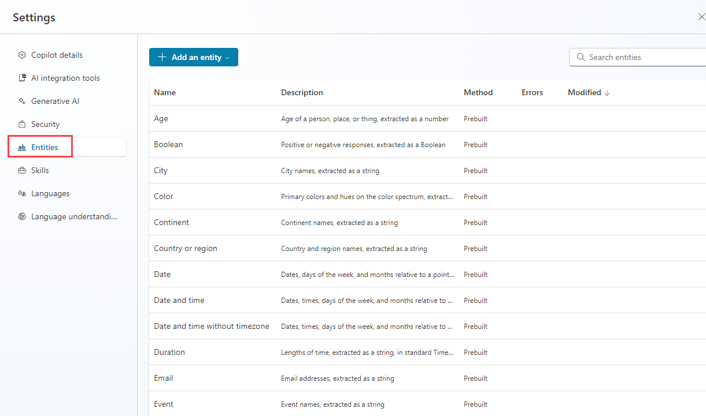
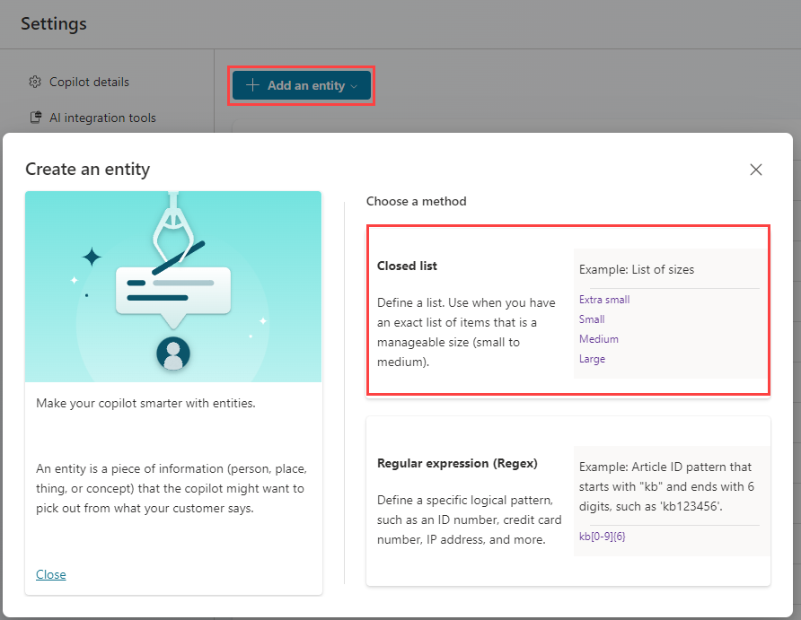
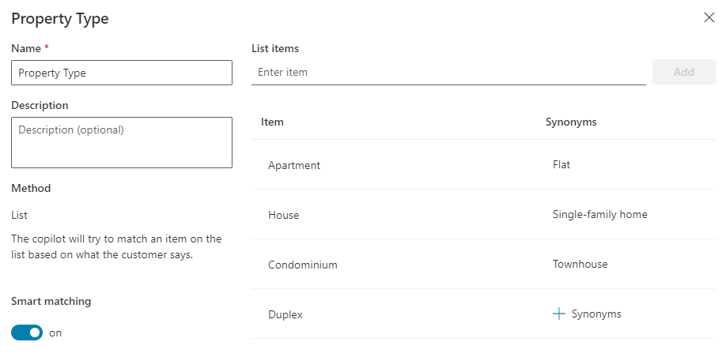
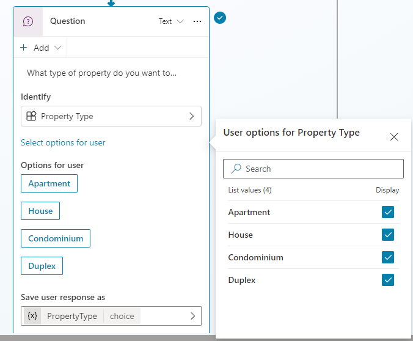

---
lab:
  title: Mit Entitäten arbeiten
  module: Work with entities and variables in Microsoft Copilot Studio
---

# Mit Entitäten arbeiten

## Szenario

In dieser Übung führen Sie die folgenden Schritte aus:

- Erstellen und Verwenden von Entitäten

Diese Übung dauert etwa **15** Minuten.

## Lernziele

- Erstellen und Verwenden von Entitäten zur Verbesserung des Agents

## Weiterführende Schritte des Lab

- Entitäten erstellen
- Verwenden von Entitäten in Knoten
  
## Voraussetzungen

- Erfordert abgeschlossenes **Lab: Verwalten von Knoten**

## Ausführliche Schritte

## Übung 1: Erstellen von Entitäten

Microsoft Copilot Studio verwendet Entitäten, um die Benutzerabsicht zu verstehen. Es gibt viele vorgefertigte Entitäten für häufig verwendete Informationen. Sie können benutzerdefinierte Entitäten für Ihren spezifischen Zweck erstellen.

### Aufgabe 1.1: Anzeigen vordefinierter Entitäten

1. Navigieren Sie zum Microsoft Copilot Studio-Portal `https://copilotstudio.microsoft.com` und stellen Sie sicher, dass Sie sich in der entsprechenden Umgebung befinden.

1. Wählen Sie **Agenten** im linken Navigationsbereich aus.

1. Wählen Sie den Agent **Immobilienbuchungsdienst** aus, den Sie im vorherigen Lab erstellt haben.

1. Wählen Sie oben rechts auf dem Bildschirm **Einstellungen** aus.

1. Wählen Sie die Registerkarte **Entitäten** aus.

    

### Aufgabe 1.2: Erstellen der Eigenschaftstypentität

1. Wählen Sie **+ Entität hinzufügen** und wählen Sie **+ Neue Entität**.

    

1. Wählen Sie die Kachel **Geschlossene Liste**.

1. Geben Sie **`Property Type`** in das Feld **Name** ein.

1. Geben Sie **`Apartment`** in das Feld **Eintrag eingeben** ein und wählen Sie **Hinzufügen**.

1. Geben Sie **`Condominium`** in das Feld **Eintrag eingeben** ein und wählen Sie **Hinzufügen**.

1. Geben Sie **`Duplex`** in das Feld **Eintrag eingeben** ein und wählen Sie **Hinzufügen**.

1. Geben Sie **`House`** in das Feld **Eintrag eingeben** ein und wählen Sie **Hinzufügen**.

1. Wählen Sie **+ Synonyme** für **Apartment** aus, geben Sie **`Flat`** ein und wählen Sie das Symbol **+** und wählen Sie anschließend **Fertig**.

1. Wählen Sie **+ Synonyme** für **Condominium**, geben Sie **`Townhouse`** ein und wählen Sie das Symbol **+** und wählen Sie anschließend **Fertig**.

1. Wählen Sie **+ Synonyme** für **Haus**, geben Sie **`Single-family home`** ein und wählen Sie das Symbol **+** und wählen Sie anschließend **Fertig**.

1. Aktivieren Sie die **Intelligente Übereinstimmung**.

    

1. Wählen Sie **Speichern**.

1. Wählen Sie **Schließen** aus.

### Aufgabe 1.3: Erstellen der Anzahl der Schlafzimmer-Entität

1. Wählen Sie **+ Entität hinzufügen** und wählen Sie **+ Neue Entität**.

1. Wählen Sie die Kachel **Regulärer Ausdruck (Regex)** aus.

1. Geben Sie **`Number of Bedrooms`** in das Feld **Name** ein.

1. Geben Sie **`[1-5]`** in das Feld **Muster** ein.

1. Wählen Sie **Speichern**.

1. Wählen Sie **Schließen** aus.

1. Wählen Sie oben rechts das **X-Symbol** aus, um die Einstellungen zu schließen und zu Ihrem Agent zurückzukehren.

## Übung 2: Verwenden von Entitäten zur Verbesserung des Agents

Verwenden Sie Entitäten im Unterhaltungsflow, um den Agent zu verbessern.

### Aufgabe 2.1: Verwenden von Entitäten

1. Wählen Sie die Registerkarte **Themen**.

1. Wählen Sie das Thema **Immobilienbesichtigung buchen**.

1. Wählen Sie das Symbol **+** zwischen den Knoten **Bedingung** und Eigenschaft **Frage** und wählen Sie dann **Frage stellen**.

1. Geben Sie in das Feld **Nachricht eingeben** den folgenden Text ein:

    `What type of property do you want to see?`

1. Wählen Sie **Eigenschaftstyp** für **Identifizieren**.

1. Wählen Sie **Optionen für Benutzer auswählen** und aktivieren Sie die Option **Anzeigen** für alle vier Werte.

1. Wählen Sie die Variable in **Benutzerantwort speichern unter** und geben Sie **`PropertyType`** als **Variablennamen** ein.

    

1. Wählen Sie das **+** Symbol unter dem neuen **Frage**-Knoten und wählen Sie **Frage stellen**.

1. Geben Sie in das Feld **Nachricht eingeben** den folgenden Text ein:

    `How many bedrooms do you need?`

1. Wählen Sie **Anzahl der Schlafzimmer** für **Identifizieren** aus.

1. Wählen Sie die Variable in **Benutzerantwort speichern unter** und geben Sie **`NumberofBedrooms`** als **Variablennamen** ein.

1. Wählen Sie **Speichern**.
