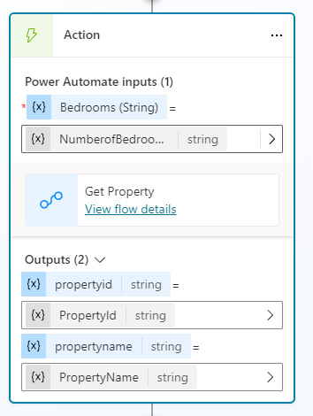

---
lab:
  title: Erstellen von Agentaktionen
  module: Enhance Microsoft Copilot Studio agents
---

# Erstellen von Agent-Flows

## Szenario

In dieser Übung führen Sie die folgenden Schritte aus:

- Erstellen eines Agent-Flow

Diese Übung dauert etwa **30** Minuten.

## Lernziele

- So erstellen Sie ein Tool zum Ausführen eines Agent-Flows in Copilot Studio

## Weiterführende Schritte des Lab

- Erstellen eines Agent-Flows zum Abrufen von Dataverse-Daten mit einer Agent-Aktion
- Erstellen eines Agent-Flows zum Erstellen von Dataverse-Daten mit einer Agent-Aktion
  
## Voraussetzungen

- Erfordert abgeschlossenes **Lab: Arbeiten mit Entitäten**

## Ausführliche Schritte

## Übung 1: Erstellen einer Agent-Aktion zum Abrufen von Daten aus Dataverse

Microsoft Copilot Studio kann mithilfe von Agent-Flows auf Daten in Microsoft Dataverse zugreifen.

### Aufgabe 1.1: Erstellen eines Agent-Flow zum Abrufen einer Eigenschaft

1. Navigieren Sie zum Microsoft Copilot Studio-Portal `https://copilotstudio.microsoft.com` und stellen Sie sicher, dass Sie sich in der entsprechenden Umgebung befinden.

1. Wählen Sie **Agenten** im linken Navigationsbereich aus.

1. Wählen Sie den **Immobilienbuchungsdienst** aus, den Sie im vorherigen Lab erstellt haben.

1. Wählen Sie die Registerkarte **Tools** aus.

1. Wählen Sie **+ Tool hinzufügen** aus.

1. Wählen Sie **+ Neues Tool** aus.

1. Wählen Sie **Agent-Flow** aus.

1. Wählen Sie den Trigger-Schritt **Wenn ein Agent den Flow anruft** und wählen Sie **+ Einen Input hinzufügen**.

1. Wählen Sie **Text** aus.

1. Geben Sie `Bedrooms` für **Eingabe** und `Number of Bedrooms` für **Bitte Eingabe eingeben** ein.

    

1. Wählen Sie das Symbol **+** zwischen den beiden Schritten im Flow, um eine neue Aktion hinzuzufügen.

1. Geben Sie `Dataverse` in das Feld **Suchen** ein und wählen Sie **Mehr anzeigen** für den **Microsoft Dataverse**-Connector.

    

1. Wählen Sie die Aktion **Zeilen auflisten**.

1. Wenn Sie zur Authentifizierung aufgefordert werden, geben Sie `Lab connection` für **Verbindungsname** ein, wählen Sie **OAuth** für **Authentifizierungstyp aus, und wählen Sie **Anmelden** aus.

    > **Hinweis:** Wenn Sie die Fehlermeldung '**Fehler beim Erstellen der OAuth-Verbindung** sehen, müssen Sie möglicherweise Popups in Ihrem Browser zulassen.

    

    

1. Wählen Sie **Immobilien** als Tabellenname.

1. Geben Sie `contoso_bedrooms eq ` (mit einem Leerzeichen nach **eq**) in das Feld **Filterzeilen** ein.

1. Wenn das Feld **Filterreihen** noch immer ausgewählt ist, wählen Sie das **Blitz**-Symbol rechts daneben und dann den Parameter **Bedrooms**.

    

    > **Wichtig:** Stellen Sie sicher, dass zwischen „eq” und „Bedrooms” ein Leerzeichen steht.

1. Wählen Sie die Aktion **Auf Copilot reagieren** im Dokumenterstellungsbereich aus, und wählen Sie **+ Ausgabe hinzufügen** aus.

1. Wählen Sie **Text** aus.

1. Geben Sie `PropertyId` für **Namen eingeben** ein

1. Markieren Sie das Feld **Wert eingeben, um zu antworten mit** und wählen Sie **fx (Ausdruck einfügen)** aus.

1. Geben Sie den folgenden Ausdruck in das obere Feld ein:

    ```
    first(outputs('List_rows')?['body/value'])['contoso_realestatepropertyid']
    ```

1. Wählen Sie **Hinzufügen**.

1. Wählen Sie **+ Eine Ausgabe hinzufügen** aus.

1. Wählen Sie **Text** aus.

1. Geben Sie `PropertyName` für **Namen eingeben** ein.

1. Markieren Sie das Feld **Wert eingeben, um zu antworten mit** und wählen Sie **fx (Ausdruck einfügen)** aus.

1. Geben Sie den folgenden Ausdruck ein:

    ```
    first(outputs('List_rows')?['body/value'])['contoso_propertyname']
    ```
    

1. Wählen Sie **Hinzufügen**.

1. Wählen Sie die Registerkarte **Einstellungen** im Bereich **Auf Copilot reagieren**.

1. Stellen Sie sicher, dass **Asynchrone Antwort** auf **Aus** gesetzt ist.

    

1. Wählen Sie **Entwurf speichern** in der Nähe der oberen rechten Ecke der Seite.

1. Warten Sie, bis der Speichervorgang abgeschlossen ist, und wählen Sie dann **Veröffentlichen** aus. Wählen Sie im Popup **Ihr Agent-Flow wurde erfolgreich veröffentlicht!** die Option **Zum Agent zurückkehren** aus.

1. Klicken Sie auf die Registerkarte **Übersicht**.

1. Wählen Sie im Bereich **Details** die Option **Bearbeiten** aus. 

1. Aktualisieren des **Flownamens** zu `Get Property`

1. Wählen Sie**Speichern**

1. Wählen Sie **Agents** aus, und wählen Sie den Agent **Immobilienbuchungsdienst** aus. 

1. Wählen Sie **Tools** aus, und sehen Sie sich den von Ihnen erstellten Flow „Eigenschaft abrufen“ an.


### Aufgabe 1.2: Hinzufügen der Agent-Aktion „Eigenschaft abrufen“ zum Thema

1. Wählen Sie die Registerkarte **Themen**.

1. Wählen Sie das Thema **Immobilienbesichtigung buchen**.

1. Wählen Sie das Symbol **+** unterhalb des Knotens **Wie viele Schlafzimmer benötigen Sie?** aus, wählen Sie **Tool hinzufügen** und dann den Flow **Eigenschaft abrufen** aus.

1. Wählen Sie für den Eingabeparameter **Bedrooms** die Variable **NumberofBedrooms**.

    

1. Markieren Sie die **drei Punkte** im Frageknoten **Welche Eigenschaft möchten Sie sehen?** und wählen Sie **Löschen**.

1. Wählen Sie das Symbol **+** unter dem Knoten **Aktion** und wählen Sie **Nachricht senden**.

1. In das Feld **Nachricht eingeben** geben Sie `Property ` ein (mit einem Leerzeichen dahinter).

1. Wählen Sie im gleichen Knoten das Symbol **{X} (Variable einfügen)** und wählen Sie die Variable **PropertyName**.

    

1. Wählen Sie **Speichern**.

## Übung 2: Erstellen einer Agent-Aktion zum Erstellen von Daten in Dataverse

Microsoft Copilot Studio kann mithilfe von Agent-Flows Daten in Microsoft Dataverse erstellen.

### Aufgabe 2.1: Erstellen eines Agent-Flow zum Ausführen einer Buchung

1. Wählen Sie die Registerkarte **Tools** in **Immobilienbuchungsdienst** aus.

1. Wählen Sie **+ Tool hinzufügen** aus.

1. Wählen Sie **+ Neues Tool** und dann **Agent-Flow** aus.

1. Wählen Sie **Entwurf speichern** aus, und warten Sie, bis der Agent-Flow gespeichert wurde.

1. Klicken Sie auf die Registerkarte **Übersicht**.

1. Wählen Sie im Bereich **Details** die Option **Bearbeiten** aus. 

1. Umbenennen des Flow `Create Booking Request`

1. Wählen Sie **Speichern**.

1. Wählen Sie die Registerkarte **Designer** aus.

1. Wählen Sie den Trigger-Schritt **Wenn ein Agent den Flow anruft** und wählen Sie **+ Einen Input hinzufügen**.

1. Wählen Sie **Text** aus.

1. Geben Sie `PropertyId` als **Eingabe** ein und `Property` für **Bitte Eingabe eingeben**.

1. Wählen Sie **+ Eingabe hinzufügen** aus.

1. Wählen Sie **Text** aus.

1. Geben Sie `ViewerName` als **Eingabe** ein und `Viewer Name` für **Bitte Eingabe eingeben**.

1. Wählen Sie **+ Eingabe hinzufügen** aus.

1. Wählen Sie **Text** aus.

1. Geben Sie `ViewerEmail` als **Eingabe** ein und `Viewer Email` für **Bitte Eingabe eingeben**.

    

1. Wählen Sie das Symbol **+** zwischen den beiden Schritten im Flow, um eine neue Aktion hinzuzufügen.

1. Geben Sie `Dataverse` in das Feld **Suchen** ein und wählen Sie **Mehr anzeigen** für den **Microsoft Dataverse**-Connector.

1. Wählen Sie die Aktion **Neue Zeile hinzufügen**.

1. Wählen Sie **Buchungsanfragen** als Tabellenname aus.

1. Geben Sie `Agent booking` in das Feld **Buchungsname** ein.

1. Wählen Sie unter **Erweiterte Parameter** die Option **Alle anzeigen** aus.

1. Geben Sie `contoso_bookingrequests()` in das Feld **Eigenschaft (Immobilieneigenschaften)** ein, bewegen Sie den Cursor innerhalb der Klammern, wählen Sie das **Blitz**-Symbol und wählen Sie dann den Parameter **PropertyId**.

1. Markieren Sie das Feld **Betrachter-E-Mail**, wählen Sie das **Blitz**-Symbol und wählen Sie dann den Parameter **ViewerEmail**.

1. Markieren Sie das Feld **Betrachtername**, wählen Sie das **Blitz**-Symbol und wählen Sie dann den Parameter **ViewerName**.

    

1. Wählen Sie die Aktion **Auf Copilot reagieren** aus.

1. Wählen Sie die Registerkarte **Einstellungen** aus.

1. Stellen Sie sicher, dass **Asynchrone Antwort** auf **Aus** gesetzt ist.

1. Wählen Sie **Entwurf speichern** in der oberen rechten Ecke des Fensters.

1. Warten Sie, bis der Speichervorgang abgeschlossen ist, und wählen Sie dann **Veröffentlichen** aus.

1. Wählen Sie die Registerkarte **Übersicht** aus.

1. Wählen Sie im Bereich „Details“ die Option **Bearbeiten** aus.

1. Umbenennen des Agent-Flow `Create Booking Request`

1. Wählen Sie **Speichern**.

### Aufgabe 2.2: Überprüfen der Tools

1. Wählen Sie **Agents** aus, und öffnen Sie den Agent **Immobilienbuchungsdienst**.

1. Wählen Sie die Registerkarte **Tools** aus, und überprüfen Sie, ob sich beide Agent-Flows in der Liste befinden. Wählen Sie andernfalls **+Tool hinzufügen** > **Flow** > aus, und wählen Sie den fehlenden Agent-Flow aus. Wählen Sie **Zum Agent hinzufügen** aus.

### Aufgabe 2.3: Hinzufügen der Agent-Aktion „Buchungsanfrage erstellen“ zum Thema

1. Wählen Sie die Registerkarte **Themen**.

1. Wählen Sie das Thema **Immobilienbesichtigung buchen**.

1. Wählen Sie das Symbol **+** unterhalb des Knotens **An welchem Datum und zu welcher Uhrzeit möchten Sie die Immobilie sehen?** aus, wählen Sie **Tool hinzufügen** und dann den Flow **Buchungsanfrage erstellen** aus.

1. Wählen Sie die Variable **PropertyId** für den Eingabeparameter **PropertyId**.

1. Wählen Sie die Variable **Name** für den Eingabeparameter **ViewerName**.

1. Wählen Sie die Variable **EmailAddress** für den Eingabeparameter **ViewerEmail**.

1. Wählen Sie das Symbol **+** unter dem neuen Knoten **Aktion**, wählen Sie **Themenverwaltung**, wählen Sie **Zu einem anderen Thema wechseln** und wählen Sie **Gespräch beenden**.

1. Wählen Sie **Speichern**.

1. Wählen Sie **Veröffentlichen** und wählen Sie erneut **Veröffentlichen** aus.

## Übung 3: Testen der Agent-Aktionen

### Aufgabe 3.1: Stellen einer Buchungsanfrage

1. Falls geschlossen, wählen Sie die Schaltfläche **Testen** in der oberen rechten Ecke des Bildschirms, um das Bedienfeld zum Testen zu öffnen.

1. Wählen Sie die **drei Punkte** am oberen Rand des Bedienfelds oben rechts auf dem Bildschirm.

    

1. Wenn sie nicht aktiviert ist, aktivieren Sie **Nachverfolgen der Themenverläufe**.

1. Wählen Sie das Symbol **Neue Konversation beginnen** (Aktualisieren) oben auf dem Testpanel aus.

1. Wenn die Meldung **Gesprächsbeginn** erscheint, wird Ihr Agent ein Gespräch beginnen. Geben Sie als Antwort einen Triggerausdruck für das Thema ein, das Sie erstellt haben.

    `I want to book a real estate showing`

1. Geben Sie die folgenden Informationen ein:

    ```
    Name: <Your name>
    ```
    ```
    Email address: <Your email address>
    ```

1. Nachdem Sie die Informationen angegeben haben, zeigt eine adaptive Karte die eingegebenen Informationen an und fragt, ob die Details korrekt sind. Wählen Sie **Ja** aus.

1. Wählen Sie **Haus** für die Art der Immobilie aus.

1. Geben Sie `3` für die Anzahl der Schlafzimmer ein.

    

1. Geben Sie `Tomorrow 2:00 PM` in den Prompt **An welchem Datum und zu welcher Uhrzeit möchten Sie die Immobilie sehen?** ein.

1. Wählen Sie **Ja** auf die Aufforderung **Hat das Ihre Frage beantwortet?**.

1. Wählen Sie eine beliebige Bewertung aus.

1. Wählen Sie **Nein** bei der Aufforderung **Kann ich sonst noch helfen?**.

### Aufgabe 3.2: Überprüfen der Buchungsanfrage

1. Falls noch nicht geöffnet, navigieren Sie zu `https://make.powerapps.com` in einer neuen Registerkarte.

1. Stellen Sie sicher, dass Sie sich in der richtigen Umgebung befinden.

1. Wählen Sie im linken Navigationsbereich die Option **Apps** aus.

1. Wählen Sie **Wiedergeben** auf der modellgesteuerten App **Immobilienverwaltung**.

1. Wählen Sie in der linken Navigation **Buchungsanfragen**. Sehen Sie sich die Buchungsanfrage an, die Ihr Agent soeben für Sie erstellt hat.

    
