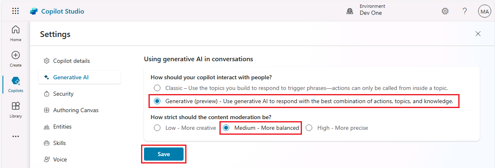
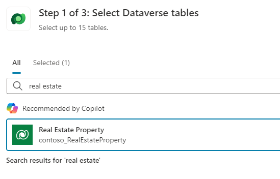
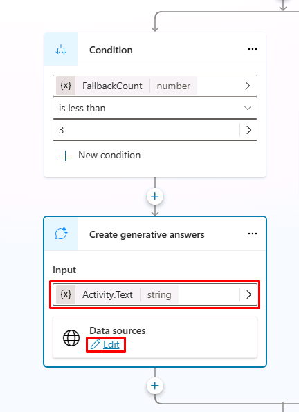

---
lab:
  title: Verwenden generativer KI in Microsoft Copilot Studio
  module: Enhance Microsoft Copilot Studio copilots
---

# Verwenden generativer KI in Microsoft Copilot Studio

## Szenario

Dieses Lab deckt Folgendes ab:

- Erstellen von Agentaktionen

## Lernziele

- Verwendung der Funktion „Generative Antworten“, um die Antworten Ihres Agents zu verbessern.

## Weiterführende Schritte des Lab

- Aktivieren von generativer KI
- Hinzufügen von Wissen
  
## Voraussetzungen

- Erfordert abgeschlossenes **Lab: Erstellen von Agent-Aktionen**

## Ausführliche Schritte

## Übung 1: Konfigurieren von generativer KI

### Aufgabe 1.1: Aktivieren von generativer KI

1. Wenn es noch nicht geöffnet ist, rufen Sie das Microsoft Copilot Studio-Portal `https://copilotstudio.microsoft.com` auf und stellen Sie sicher, dass Sie sich in der entsprechenden Umgebung befinden.

1. Wählen Sie **Agents** in der linken Navigation aus.

1. Wählen Sie den **Immobilienbuchungsdienst** aus, den Sie im vorherigen Lab erstellt haben.

1. Wählen Sie die Schaltfläche **Einstellungen** oben rechts auf dem Bildschirm.

1. Wählen Sie die Registerkarte **Generative KI**.

1. Wählen Sie **Generativ** unter **Wie sollte Ihr Agent mit Menschen interagieren?**.

1. Wählen Sie **Mittel – Ausgewogener** für **Wie streng soll die Inhaltsmoderation sein?**.

1. Wählen Sie **Speichern**.

    

1. Schließen Sie das Menü **Einstellungen**, indem Sie das Symbol **X** in der oberen rechten Ecke von Copilot Studio auswählen.

### Aufgabe 1.2: Verwenden von generativen Antworten im Thema „Unterhaltungsförderung“

1. Wählen Sie die Registerkarte **Themen** und wählen Sie den **Systemfilter**.

1. Wählen Sie das Thema **Unterhaltungsförderung**.

    

1. Überprüfen Sie den Knoten **Generative Antworten erzeugen**.

### Aufgabe 1.3: Aktivieren von Wissen

1. Klicken Sie auf die Registerkarte **Übersicht**.

1. Überprüfen Sie, ob Allgemeinwissen **Aktiviert** ist.

    

1. Die öffentliche Website sollte in einem vorherigen Lab als Wissensquelle hinzugefügt werden.

### Aufgabe 1.4: Konfigurieren der Authentifizierung

1. Wählen Sie oben rechts auf dem Bildschirm **Einstellungen** aus.

1. Wählen Sie die Registerkarte **Sicherheit** .

1. Wählen Sie die Kachel **Authentifizierung** aus.

1. Wählen Sie **Mit Microsoft authentifizieren**.

1. Wählen Sie **Speichern**.

1. Wählen Sie **Speichern**.

1. Schließen Sie das Menü **Einstellungen**, indem Sie das **X** in der oberen rechten Ecke von Copilot Studio auswählen.

1. Wählen Sie **Veröffentlichen** und wählen Sie erneut **Veröffentlichen** aus.

## Übung 2: Hinzufügen von Wissen

### Aufgabe 2.1: Hinzufügen von Wissen aus Dataverse

1. Wählen Sie die Registerkarte **Wissen**.

1. Wählen Sie **+ Wissen hinzufügen**.

1. Wählen Sie **Dataverse** aus.

1. Wählen Sie die Tabelle **Real Estate Property** aus.

    

1. Wählen Sie **Weiter** aus.

1. Wählen Sie **Weiter** aus.

1. Wählen Sie **Hinzufügen**.

### Aufgabe 2.2. Hinzufügen von Wissen aus Dateien

1. Laden Sie diese [**Microsoft Fallstudie**](https://download.microsoft.com/documents/customerevidence/Files/4000007499/SummitRealtyCaseStudy.docx) oder [**SummitRealtyCaseStudy.docx**](../../Allfiles/SummitRealtyCaseStudy.docx) von GitHub herunter.

1. Wählen Sie **+ Wissen hinzufügen**.

1. Wählen Sie **Dateien** aus.

1. Wählen Sie unter **Dateien hochladen** die Fallstudie aus, die Sie heruntergeladen haben.

    

1. Wählen Sie **Hinzufügen**.

    

## Übung 3: Konfigurieren eines Fallbackthemas

### Aufgabe 3.1: Verwenden von generativen Antworten im Systemfallbackthema

1. Wählen Sie die Registerkarte **Themen** und wählen Sie den **Systemfilter**.

1. Wählen Sie das **Fallbackthema** aus.

    

1. Wählen Sie die **drei Punkte** im Knoten **Nachricht** aus und wählen Sie **Löschen**.

1. Wählen Sie das Symbol **+** unter dem Knoten **Bedingungen**, wählen Sie **Erweitert** und wählen Sie **Generative Antworten**.

1. Wählen Sie **Activity.Text** für das Feld **Eingabe**.

1. Wählen Sie **Bearbeiten** unter **Datenquellen** aus.

    

1. Wählen Sie **Nur ausgewählte Quellen suchen**.

1. Wählen Sie die Dataverse-Tabelle **Immobilien**.

1. Deaktivieren Sie **Der KI erlauben, ihr eigenes Allgemeinwissen zu verwenden**.

1. Aktivieren Sie das Kontrollkästchen **Anpassen** unter **Wie streng soll die Inhaltsmoderation sein?** und wählen Sie dann **Mittel**.

    

1. Wählen Sie **Speichern**.

## Übung 4: Testen generativer KI

### Aufgabe 4.1: Testen des Agent-Wissens

1. Falls noch nicht geöffnet, wählen Sie die Schaltfläche **Test** in der oberen rechten Ecke des Bildschirms, um das Bedienfeld für Tests zu öffnen.

1. Wählen Sie das Symbol **Konversationskarte** am oberen Rand des Testfelds oben rechts auf dem Bildschirm.

    

1. Wählen Sie **An**.

1. Wählen Sie das Symbol **Neue Konversation beginnen** oben auf dem Bedienfeld für Tests.

1. Beobachten Sie den Agent, und stellen Sie fest, wie er die Wissensquellen verwendet.
