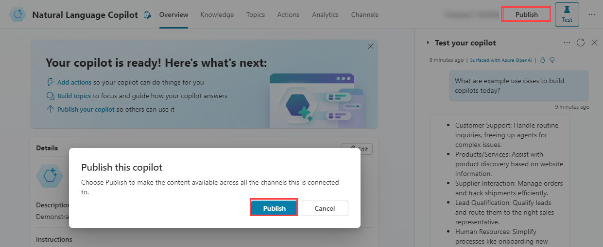
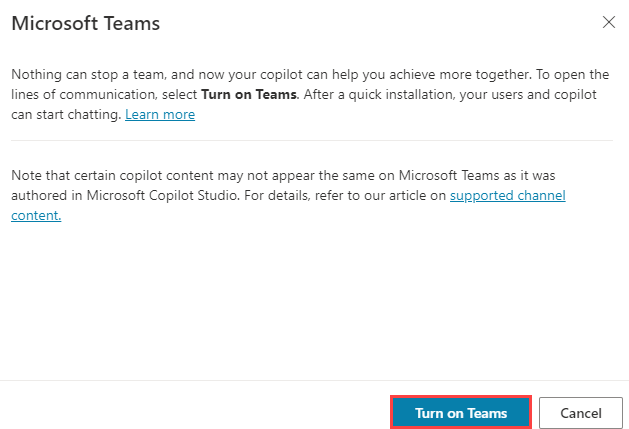

---
lab:
  title: Bereitstellen eines Agents in Microsoft Teams
  module: Create an agent with Microsoft Copilot Studio and Dataverse for Teams
---

# Bereitstellen eines Agents in Microsoft Teams

## Szenario

Dieses Lab deckt Folgendes ab:

- Erstellen von Agentaktionen

## Lernziele

- Bereitstellen eines Agents in Microsoft Teams

## Weiterführende Schritte des Lab

- Veröffentlichen
- Bereitstellen eines Agents in Microsoft Teams
  
## Voraussetzungen

- Erfordert abgeschlossenes **Lab: Verwendung generativer KI in Microsoft Copilot Studio**

## Ausführliche Schritte

## Übung 1 – Veröffentlichen des Agents

### Aufgabe 1.1: Veröffentlichen der neuesten Inhalte

1. Navigieren Sie zum Microsoft Copilot Studio-Portal `https://copilotstudio.microsoft.com` und stellen Sie sicher, dass Sie sich in der entsprechenden Umgebung befinden.

1. Wählen Sie **Agenten** im linken Navigationsbereich aus.

1. Wählen Sie den Agent aus, den Sie im vorherigen Lab erstellt haben.

1. Wählen Sie **Veröffentlichen** und wählen Sie erneut **Veröffentlichen** aus.

   

   > **Hinweis:** Die Veröffentlichung kann ein paar Minuten in Anspruch nehmen.

## Übung 2: Kanäle

Wenn Ihr Agent veröffentlicht wurde, können Sie Ihren Agent für Benutzende in Teams zur Verfügung stellen. Auf diese Weise können Sie, Ihre Teamkollegen bzw. -kolleginnen und Ihre breitere Organisation damit interagieren.

### Aufgabe 2.1: Microsoft Teams-Kanal

1. Wenn Ihr Agent in Microsoft Copilot Studio geöffnet ist, wählen Sie die Registerkarte **Kanäle**.

    

1. Wählen Sie die Kachel **Microsoft Teams**.

    

1. Wählen Sie **Teams aktivieren** aus.

    

1. Wählen Sie **Verfügbarkeitsoptionen** aus.

    

1. Wählen Sie **Link kopieren** aus.

1. Wählen Sie **Meinen Teamkollegen und freigegebenen Benutzern zeigen** aus.

1. Wählen Sie das entsprechende Benutzerkonto aus.

1. Wählen Sie den Zurück-Pfeil oben links im Bereich aus.

1. Wählen Sie **Teilen** aus.

### Aufgabe 2.2: Microsoft Teams

1. Wechseln Sie in einem neuen Tab zu Microsoft Teams `https://teams.microsoft.com`.

1. Melden Sie sich bei Teams an, wenn Sie dazu aufgefordert werden.

1. Wählen Sie in der linken Navigation **Teams** aus.

1. Sie werden ein Team mit dem Namen **Contoso** mit dem Kanal **Allgemein** sehen.

1. Öffnen Sie eine neue Registerkarte, und wechseln Sie zum URL-Link, der in die vorherige Aufgabe kopiert wurde.

1. Wählen Sie **Abbrechen** im Dialogfeld für **Diese Seite versucht, Microsoft Teams zu öffnen**.

1. Wählen Sie **Stattdessen die Web-App verwenden**.

1. Wählen Sie **Hinzufügen**.

    

1. Testen des Agents.

    
